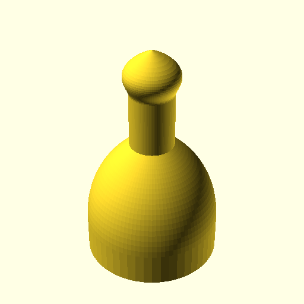
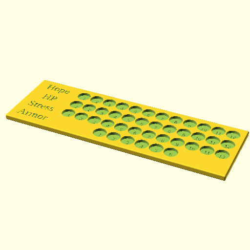

# Daggerheart Tracker

This project contains OpenSCAD files for generating a Daggerheart tracker and related pieces. While originally designed with Daggerheart in mind it could actually be used to track any type of resource.

## Features
The tracker is fully customizable for the labels and rows. The text is a separate file so that it can easily be generated for 3d printing in another color (most likely the same color as the pieces) and then is pressed into the tracker board.

## Getting Started

To use these OpenSCAD files, you will need OpenSCAD installed on your system. You can download it from [openscad.org](https://openscad.org/).

### BOSL2 Library

This project utilizes the Building Blocks OpenSCAD Library (BOSL2). You can obtain BOSL2 by visiting https://github.com/BelfrySCAD/BOSL2.

Once downloaded, place the `BOSL2` folder in a location where OpenSCAD can find it. Common locations include:

*   Next to your `.scad` files (e.g., in the directory `src`).
*   In your OpenSCAD library folder (check OpenSCAD's preferences for "Library Folder").

## Usage

Open the `.scad` files (e.g., `tracker.scad`, `piece.scad`, `text.scad`) in OpenSCAD. You can customize various parameters using the Customizer panel within OpenSCAD.

After making changes, you can render the model (F6) and export it as an STL for 3D printing.

## Individual Pieces

### Piece

**Key Parameters:**
*   `base_diameter`: Diameter of the pawn's base.
*   `base_height`: Height of the pawn's base.
*   `stem_diameter`: Diameter of the pawn's stem.
*   `stem_height`: Height of the pawn's stem.
*   `head_diameter`: Diameter of the pawn's head.
*   `peg_height`: Height of the peg extending from the base.

### Text

**Key Parameters:**
*   `text_to_generate`: Which text to generate (e.g., "HP", "Hope").
*   `text_depth`: Depth of the extruded text.
*   `text_size`: Font size of the text.
*   `text_font`: Font family for the text.
*   `use_bold`: Whether to use bold style for text.
*   `use_italic`: Whether to use italic style for text.

## Tracker

**Key Parameters:**

**Box:**
*   `box_height`: Height of the main box.
*   `fillet_radius`: Radius for the filleted edges of the box.
*   `outer_border`: Space around the entire content (holes + labels).
*   `label_to_hole_spacing`: Space between the longest label and the closest hole.

**Grid of Holes:**
*   `hole_diameter`: Diameter of each hole.
*   `hole_depth`: Depth of each hole.
*   `row_hole_counts`: Comma-separated string of hole counts for each row (e.g., "12,12,12,6").
*   `spacing_x`: Horizontal spacing between holes in a row.
*   `spacing_y`: Vertical spacing between rows of holes.

**Row Labels:**
*   `text_depth`: Depth of the engraved text labels.
*   `text_size`: Font size for the text labels.
*   `text_font`: Font family for the text labels.
*   `text_labels`: Comma-separated string of labels for each row.
*   `use_bold`: Whether to use bold style for text.
*   `use_italic`: Whether to use italic style for text.

**Numbers in Holes:**
*   `show_numbers`: Whether to engrave numbers inside the holes.
*   `number_size`: Font size for the numbers.
*   `number_depth`: Depth of the engraved numbers.